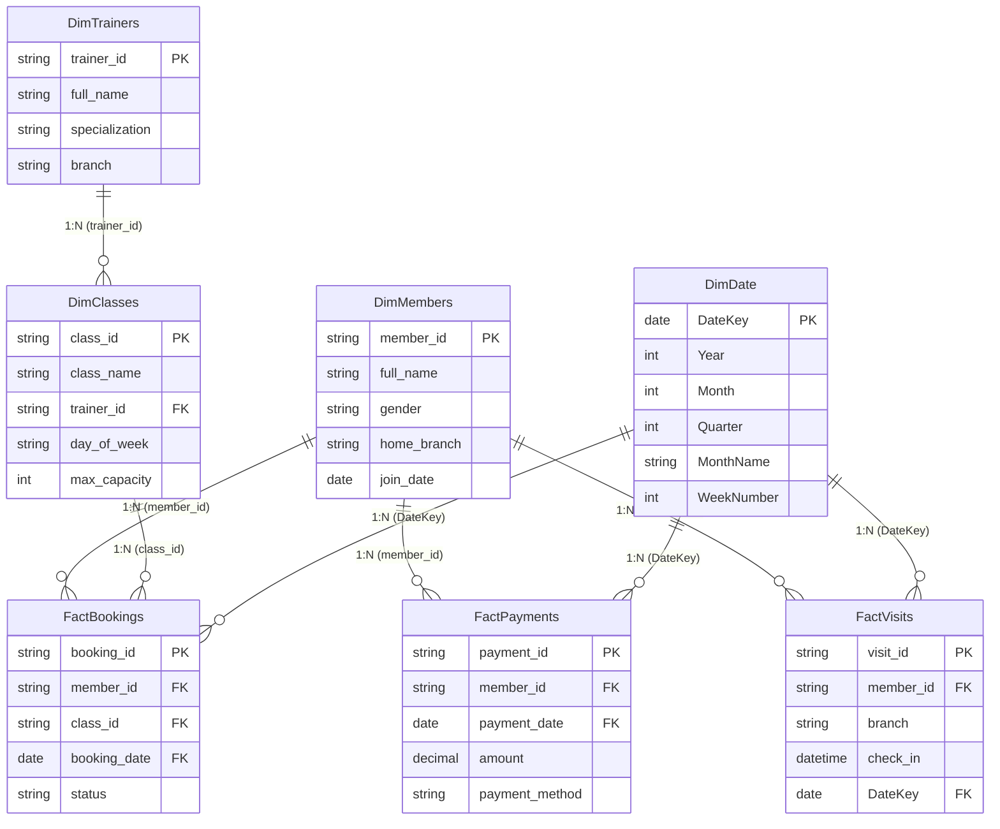

# PulseFit Data Model Diagram

This Mermaid diagram illustrates the **Star Schema** architecture designed for the PulseFit BI project.

> [!IMPORTANT]
> **Why we use a `DimDate` table**:
> 1. **Time Intelligence**: Essential for calculating Year-over-Year (YOY) and Month-over-Month (MOM) growth. Standard date columns from raw data can have "gaps" (days with no transactions), which break these complex formulas.
> 2. **Unified Filtering**: Allows a single "Month" or "Year" slicer to control every chart in the dashboard simultaneously (Revenue, Visits, and Bookings).
> 3. **Extended Metadata**: Automatically provides attributes like "IsWeekend", "Quarter", or "Public Holiday" without manual coding.
